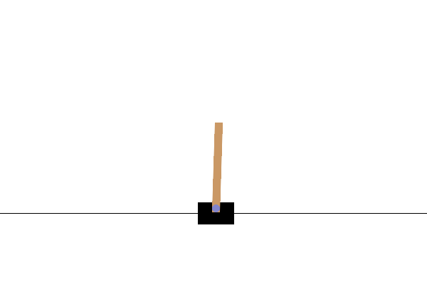
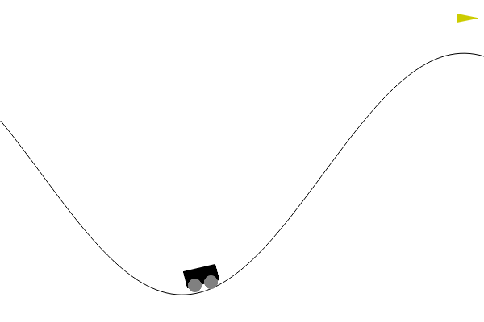
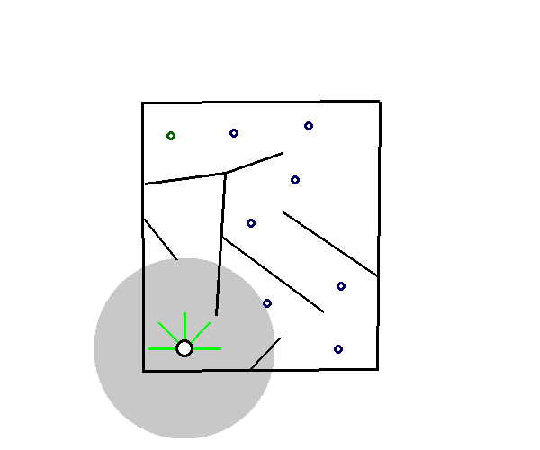

# Neuroevolution: Evolving Neural Networks with Genetic Algorithms

A modular Python package implementing Artificial Neural Networks (ANN) trained using Genetic Algorithms (GA via PyMOO) to solve OpenAI Gymnasium environments including **CartPole**, **MountainCar**, and **Maze** (`HardMaze`).

## Overview

This project demonstrates the application of neuroevolution, combining PyTorch neural networks with genetic algorithms to evolve optimal control policies without traditional backpropagation.

## Supported Environments

| Environment | Gym ID | Observation Space | Action Space | Description |
| :--- | :--- | :--- | :--- | :--- |
| **CartPole** | `CartPole-v1` | `Box(4)` | `Discrete(2)` | Balance a pole on a moving cart |
| **MountainCar** | `MountainCar-v0` | `Box(2)` | `Discrete(3)` | Drive a car up a steep hill |
| **Maze** | `HardMaze-v0` | `Box(9)` | `Box(3)` | Navigate a robot through a complex maze |

## Demos

| **CartPole** (`CartPole-v1`) | **MountainCar** (`MountainCar-v0`) | **Maze** (`HardMaze-v0`) |
| :---: | :---: | :---: |
|  |  |  |
| *Pole balancing control* | *Momentum building & hill climb* | *Complex maze navigation* |

---

## Installation

### Using Poetry (Recommended)

```bash
# Clone the repository
git clone https://github.com/carloshkayser/neuroevolution.git
cd neuroevolution

# Install dependencies and package
poetry install
```

### Using pip / virtualenv

```bash
# Install in editable mode
pip install -e .
```

---

## Usage

### 1. Command Line Interface (CLI)

Once installed, you can use the `neuroevolution` command (or `python -m neuroevolution` / `python main.py`):

#### Training
```bash
# Train on CartPole (default)
neuroevolution --train --env CartPole

# Train on MountainCar
neuroevolution --train --env MountainCar --generations 100 --population 50

# Train on Maze (HardMaze navigation)
neuroevolution --train --env Maze --generations 150 --population 60

# Custom network architecture
neuroevolution --train --env CartPole --hidden-layers 64 32 16

# Advanced GA hyperparameters
neuroevolution --train --generations 100 --population 50 --crossover-prob 0.9 --mutation-prob 0.1
```

#### Testing / Evaluation
```bash
# Evaluate trained CartPole model
neuroevolution --test --env CartPole

# Evaluate trained MountainCar model
neuroevolution --test --env MountainCar --render

# Evaluate trained Maze model
neuroevolution --test --env Maze
```

#### Recording Demos (GIFs)
```bash
# Record GIF for trained CartPole model
neuroevolution --record-gif --env CartPole

# Record GIF for trained MountainCar model
neuroevolution --record-gif --env MountainCar

# Record GIF for trained Maze model
neuroevolution --record-gif --env Maze
```

---

### 2. Python API

You can import and use `neuroevolution` directly in your Python code:

```python
from neuroevolution import PyTorchGeneticTrainer, CartPoleNet

# 1. Create a trainer for MountainCar
trainer = PyTorchGeneticTrainer(
    env_name="MountainCar-v0",
    network_architecture=[16, 8],
    model_prefix="mountaincar_ga"
)

# 2. Train with Genetic Algorithm
best_network, best_fitness, generations = trainer.train(
    n_generations=50,
    population_size=40,
    crossover_prob=0.9,
    mutation_prob=0.1
)

# 3. Evaluate the trained policy
avg_reward, std_reward = trainer.evaluate(n_episodes=10, render=False)
print(f"Average Reward: {avg_reward:.2f} +/- {std_reward:.2f}")

# 4. Record an animated GIF of the agent
trainer.record_gif(output_path="assets/mountaincar_demo.gif", fps=30)
```
