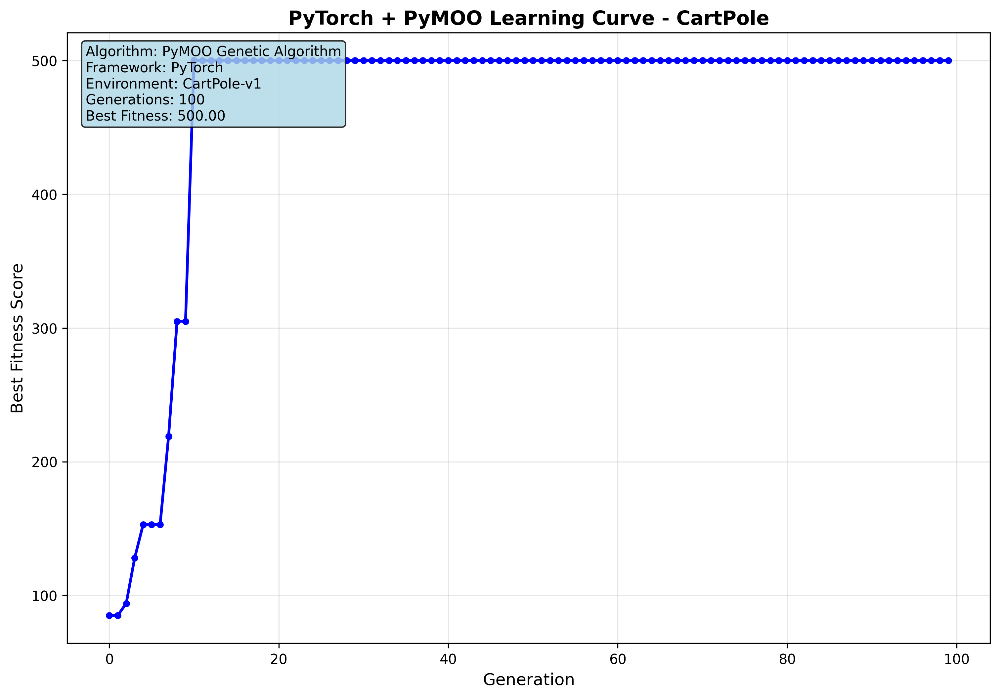

# Neuroevolution: Evolving Neural Network with Genetic Algorithms

A Python implementation of an Artificial Neural Network (ANN) trained using a Genetic Algorithm (GA) to solve OpenAI Gymnasium environments including CartPole and LunarLander.

## Overview

This project demonstrates the application of neuroevolution, combining artificial neural networks with genetic algorithms to learn optimal control policies. The implementation uses a genetic algorithm to evolve the weights of a neural network that controls various Gym environment agents, eliminating the need for traditional backpropagation-based training.

## Usage Examples

### Training
```bash
# Basic training
python main.py --train

# Custom architecture
python main.py --train --hidden-layers 64 32 16

# Advanced parameters
python main.py --train --generations 100 --population 50 --crossover-prob 0.9 --mutation-prob 0.1

# CartPole environment
python main.py --train --env CartPole --hidden-layers 128 64 32

# LunarLander environment
python main.py --train --env LunarLander --hidden-layers 128 64 32
```

### Testing
```bash
# Evaluate trained model
python main.py --test

# Evaluate with rendering
python main.py --test --render
```

## Architecture Flexibility

The implementation allows easy architecture customization:

```bash
# Small network
python main.py --train --hidden-layers 16 8

# Medium network (default)
python main.py --train --hidden-layers 64 32

# Large network
python main.py --train --hidden-layers 128 64 32 16

# Deep network
python main.py --train --hidden-layers 256 128 64 32 16 8
```

## Solving CartPole

Training CartPole with custom parameters
```bash
python main.py --env CartPole --train --generations 100 --population 50 --crossover-prob 0.9 --mutation-prob 0.1
```

After training, the best model is saved as `best_model_CartPole.pth` with the learning curve saved as `learning_curve_CartPole.png`.

<p align="center">
  
</p>

Now you can test and visualize the trained agent using:
```bash
python main.py --env CartPole --test --render
```

<p align="center">
  
</p>

## Solving LunarLander

Training LunarLander with custom parameters
```bash
python main.py --env LunarLander --train --generations 200 --population 100 --crossover-prob 0.9 --mutation-prob 0.05
```

LunarLander is a more complex continuous control task requiring the agent to land a spacecraft safely. The environment has 8 state variables and 4 discrete actions.

After training, test the agent:
```bash
python main.py --env LunarLander --test --render
```
